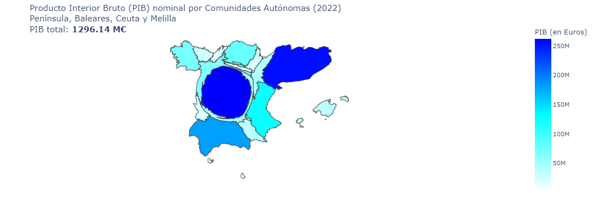
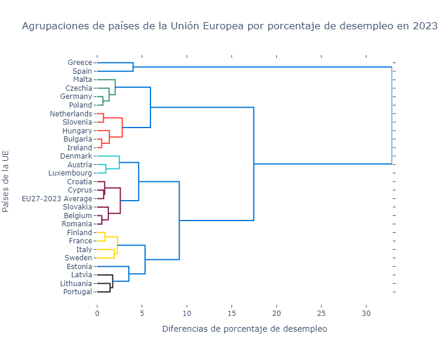
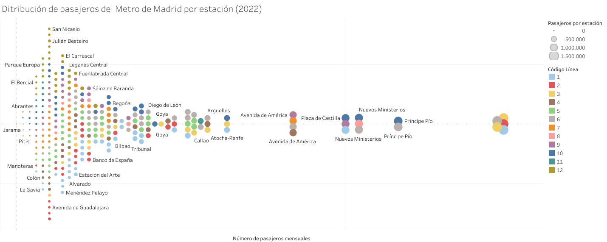

# Visualización de Datos - PEC2
### Máster en ciencia de datos - UOC
### Alumno: José Antonio Peña Carrero

Fecha publicación de los datos: 20-04-2024

## Visualización 1 - Cartograma

En la primera de las tres visualizaciones se muestra un cartograma del PIB generado por las difernetes comunidades autónomas de España excepto Canarias.

La visualización está disponible en el Notebook, realizada con la librería Plotly del lenguaje Python.

Fuentes: [INE](https://www.ine.es/dyngs/INEbase/es/operacion.htm?c=Estadistica_C&cid=1254736167628&menu=resultados&idp=1254735576581), [Go-Cart](https://go-cart.io/cart/6vd6kp7psf5siatewp42meli3ehmcc2e)

## Visualización 2 - Dendrograma Lineal

En la segunda visualización se muestran las tasas de desempleo en los diferentes estados de la Unión Europea.
El dendrograma agrupa los estados con porcentajes similares de tasas de desempleo, pues los agrupa por la menor diferencia posible entre sus valores.

Al igual que la primera visualización, está disponible en el Notebook y se ha implementado usando la librería Plotly de Python.

Fuente: [Eurostat](https://ec.europa.eu/eurostat/databrowser/view/UNE_RT_M__custom_10981417/default/table?lang=en)

## Visualización 3 - Beeswarm chart

En la última visualización realizada en Tableau, se muestra la distribución de pasajeros del Metro de Madrid en las diferentes estaciones de toda la red, y además desglosadas también por cada línea del metro.

El contenido es accesible desde el siguiente enlace a [Tableau Public](https://public.tableau.com/views/DistribucinmensualdepasajerosenelMetrodeMadridmedia2022/Hoja1?:language=es-ES&:sid=&:display_count=n&:origin=viz_share_link).

Fuente: [Ayuntamiento de Madrid](https://www.madrid.es/portales/munimadrid/es/Inicio/El-Ayuntamiento/Estadistica/Areas-de-informacion-estadistica/Trafico-transportes-y-comunicaciones/Transportes/E-M-T-y-Metro-de-Madrid/?vgnextfmt=default&vgnextoid=0c9ef2cb6e5d9210VgnVCM1000000b205a0aRCRD&vgnextchannel=4b49f9b50632a210VgnVCM1000000b205a0aRCRD)

### Licencia CC-BY 4.0

